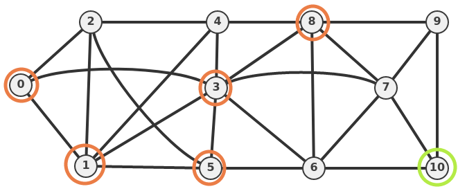

# SmartCity
The **SmartCity** is the final project delivered for the IoT course. The goal for the project was to propose and develop an idea based on the [californium](https://www.eclipse.org/californium/) framework (a powerful Eclipse implementation of the [CoAP protocol](https://datatracker.ietf.org/doc/html/rfc7252))  

## Main idea
The proposed and developed idea was the following: to simulate an ideal smart city _covered with various sensors_ that would allow a potential user to interact with them in different ways for different services 
(For a more detailed description please refer to [the proposal](SmartCity.pdf))

### The city:
 
It is represented as an acyclic graph where each node has the following sensors:

- **Air sensors**: each air sensor is mounted on a node and has four parameters monitored:
  - _pm 2.5_: monitors pm2.5 pollution, fixing both a `warning` and a `danger` level
  - _pm 10_: like the preous ones, but for pm10 pollution
  - _Temperature_: monitors the temperature, having only a `warning` level
  - _Humidity_: monitors the humidity
- **Stores sensors**: keeps track of how much a store (there exists different sotre types, e.g. bakery or pharmacy) is crowded
- **Traffic sensors**: keeps track of how much a "road" (i.e. an arch) is crowded

### Functionalities
The `Client` can do different actions:
 
- **Book a place in a store:** the user selects a store to book a place in and _if the store is not too crowded basing on the store sensors_ (imagine the typical covid-situation with a max amount of people allowed in a store) a place is reserved
- **Request in every moment for weather information**: in two different ways:
  - Aske for **air quality and temperature**
  - **Subscribe** for **regular updates** in case of **warning** values in selected sensors (this is obtained using the `Observe()` CoAP option)
- **Find the best store for a selected type basing on their position**: if the user, f.e., wants to reach a bakery store from the node **10** the client mixes the information about the user position (a node on the graph), the traffic sensors information and the store sensors information to apply **the Dijkstra** algorithm to the city graph and rank all the slected type of store basing on _how crowded they are_ and _how trafficked is the path to reach them_ 
 
 

